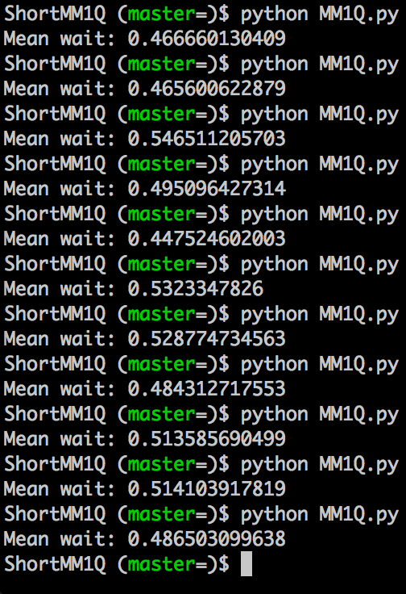

# Trying to simulate an MM1Q in as little lines of code as possible

We've got it down to -12- (thanks Harald!) lines which includes a 'docstring' at the top, a warmup period and an output of a mean wait (so if we can get it any shorter please try and keep that functionality).
A pull request would be awesome.

Here's a screenshot of the output showing a mean wait of .5 which is the theoretical value for an arrival rate of 2 and a service rate of 1:

Contributors:

- [Jason Young](https://github.com/JasYoung314)
- [Geraint Palmer](https://github.com/geraintpalmer)
- Vince Knight
- [Harald Schilly](https://github.com/haraldschilly)
